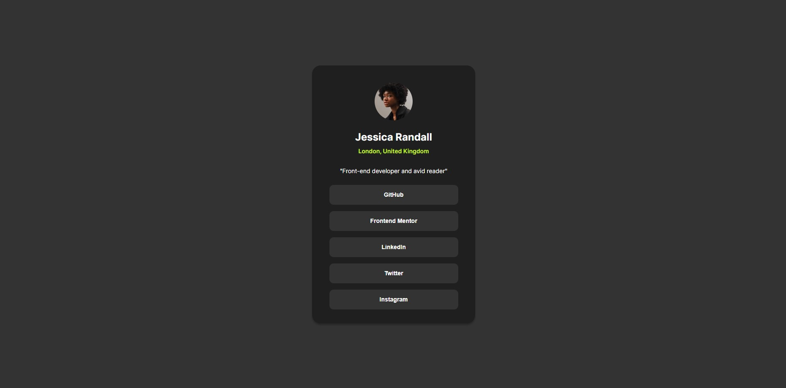
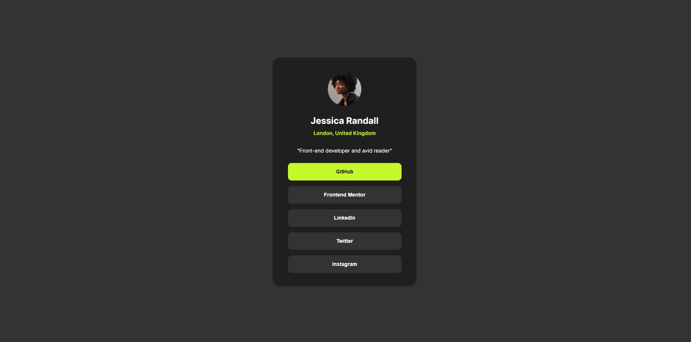
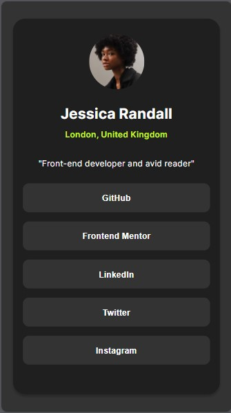

# Frontend Mentor - Social links profile solution
EN
This is a solution to the [Social links profile challenge on Frontend Mentor](https://www.frontendmentor.io/challenges/social-links-profile-UG32l9m6dQ). Frontend Mentor challenges help you improve your coding skills by building realistic projects. 

ES
Esta es la solucion al reto [Blog preview card challenge on Frontend Mentor](https://www.frontendmentor.io/challenges/blog-preview-card-ckPaj01IcS) con el objetivo de mejorar mis habilidades de programacion mediante la construccion de proyectos realistas.

## Table of contents
## Tabla de contenidos
- [Overview/Introduccion](#overview)
  - [Screenshot/Capturas de pantalla](#screenshot)
  - [Links](#links)
- [My process/Mi proceso](#my-process)
- [Author/Autor](#author)

## Overview
  This is the third challege of Frontend Mentor, the objetive of this challenge is to build out this social links profile and get it looking as close to the design as possible.
  Es es el primer reto de la pagina Frotend Mentor, el objetivo de este reto es costruir un perfil de links sociales, tratando de asemejar el diseño tanto como sea posible.
### Screenshot

### Links
/*Pendiente*/
- Solution URL: [Add solution URL here](https://your-solution-url.com)
- Live Site URL: [Add live site URL here](https://your-live-site-url.com)

## Author

- Website - [Add your name here](https://www.your-site.com)